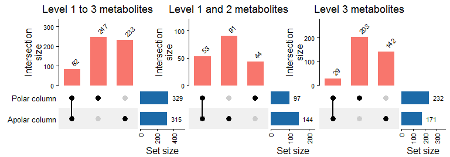

Analysis of the consensus list of metabolites identified in Rtx-5
Semi-standard non-polar colum and SH-Rtx-Wax Polar colum
================
Jefferson Pastuna
2026-05-13

- <a href="#loading-libraries-and-data"
  id="toc-loading-libraries-and-data">Loading libraries and data</a>
- <a href="#compound-identified-in-both-columns"
  id="toc-compound-identified-in-both-columns">Compound identified in both
  columns</a>
- <a href="#upset-plot" id="toc-upset-plot">UpSet plot</a>

## Loading libraries and data

Loading the necessary libraries.

``` r
library(readxl)
library(dplyr)
library(stringr)
library(ComplexHeatmap)
library(writexl)
```

Loading the consensus list of metabolites identified in polar and
non-polar columns.

``` r
# Loading features list of each software with metabolite identification
polar_ids <- read_excel(
  "../X_hylaeae_metabolomics/Result/NIST_MS_Search_polar/Consensus_IDs_polar.xlsx",
  col_types = "text")
apolar_ids <- read_excel(
  "../X_hylaeae_metabolomics/Result/NIST_MS_Search_apolar/Consensus_IDs_apolar.xlsx",
  col_types = "text")
# Merge all feature list
column_ids <- bind_rows(
  polar_ids %>% mutate(Alignment_ID = as.character(Alignment_ID),
                       Feature_ID = as.character(Feature_ID),
                       Column_type = "Polar"),
  apolar_ids %>% mutate(Alignment_ID = as.character(Alignment_ID),
                        Feature_ID = as.character(Feature_ID),
                        Column_type = "Apolar"))
```

## Compound identified in both columns

In the following code, we filter for metabolites identified in both
columns and add a “Both columns” flag to the Match_flag column.

``` r
# Add tag to repeated metabolite names
flag_column_ids <- column_ids %>%
  # Identify repeated names
  group_by(Name) %>%
  mutate(Match_flag = case_when(
    # Repeated names + existing Match_flag
    n() > 1 & !is.na(Match_flag) & Match_flag != "" ~
      paste(Match_flag, "Both column", sep = "; "),
    # Repeated names + empty Match_flag
    n() > 1 ~ "Both column",
    # Keep original values
    TRUE ~ Match_flag)) %>%
  ungroup()
```

Now we will add a new column to select the major identification level
when the metabolite was identified in both columns.

``` r
# Define IL hierarchy
il_rank <- c("Level 1" = 1, "Level 2" = 2, "Level 3" = 3)
# Create new column
il_column_ids <- flag_column_ids %>%
  # Temporary ranking column
  mutate(IL_rank_tmp = il_rank[IL]) %>%
  # Work by metabolite name
  group_by(Name) %>%
  mutate(
    # Best IL inside repeated names
    best_IL = IL[which.min(IL_rank_tmp)],
    # Final column
    IL_plot = ifelse(n() > 1, best_IL, IL)) %>%
  ungroup() %>%
  # Remove temporary columns
  select(-IL_rank_tmp, -best_IL)
```

## UpSet plot

In the following code, we will prepare the data for a graphical
representation (an UpSet plot) of the identified metabolites in both
columns.

``` r
upset_column_ids <- il_column_ids %>%
  # Work by metabolite name
  group_by(Name) %>%
  mutate(
    # Presence in Polar column
    'Polar column' = ifelse(any(Column_type == "Polar"), 1, 0),
    # Presence in Apolar column
    'Apolar column' = ifelse(any(Column_type == "Apolar"), 1, 0)) %>%
  ungroup()
```

In the following code, we remove duplicate metabolites to represent the
results in an UpSet plot across different identification levels.

``` r
# All identification levels
all_upset_col_ids <- upset_column_ids %>%
  # Deleting repeated metabolites
  distinct(Name, .keep_all = TRUE) %>%
  # Filtering the column for the UpSet plot
  select(Name, 'Polar column', 'Apolar column')
# Identification level 1 and 2
il12_upset_col_ids <- upset_column_ids %>%
  filter(IL_plot == "Level 1" | IL_plot == "Level 2") %>%
  # Deleting repeated metabolites
  distinct(Name, .keep_all = TRUE) %>%
  # Filtering the column for the UpSet plot
  select(Name, 'Polar column', 'Apolar column')
# Identification level 3
il3_upset_col_ids <- upset_column_ids %>%
  filter(IL_plot == "Level 3") %>%
  # Deleting repeated metabolites
  distinct(Name, .keep_all = TRUE) %>%
  # Filtering the column for the UpSet plot
  select(Name, 'Polar column', 'Apolar column')
# Make the combination matrix
all_col_comb_mat = make_comb_mat(all_upset_col_ids)
il12_col_comb_mat = make_comb_mat(il12_upset_col_ids)
il3_col_comb_mat = make_comb_mat(il3_upset_col_ids)
# UpSet plot
all_upset_col <- UpSet(all_col_comb_mat, row_names_gp = gpar(fontsize = 10),
                       column_title = "Level 1 to 3 metabolites",
                       top_annotation =
                         upset_top_annotation(all_col_comb_mat,
                                              gp = gpar(fill = "#F8766D",
                                                        col = "#F8766D"),
                                              add_numbers = TRUE,
                                              annotation_name_rot = 90),
                       right_annotation =
                         upset_right_annotation(all_col_comb_mat,
                                                gp = gpar(fill = "#1C6AA8",
                                                          col = "#1C6AA8"),
                                                add_numbers = TRUE))
il12_upset_col <- UpSet(il12_col_comb_mat, row_names_gp = gpar(fontsize = 10),
                       column_title = "Level 1 and 2 metabolites",
                       top_annotation =
                         upset_top_annotation(il12_col_comb_mat,
                                              gp = gpar(fill = "#F8766D",
                                                        col = "#F8766D"),
                                              add_numbers = TRUE,
                                              annotation_name_rot = 90),
                       right_annotation =
                         upset_right_annotation(il12_col_comb_mat,
                                                gp = gpar(fill = "#1C6AA8",
                                                          col = "#1C6AA8"),
                                                add_numbers = TRUE))
il3_upset_col <- UpSet(il3_col_comb_mat, row_names_gp = gpar(fontsize = 10),
                       column_title = "Level 3 metabolites",
                       top_annotation =
                         upset_top_annotation(il3_col_comb_mat,
                                              gp = gpar(fill = "#F8766D",
                                                        col = "#F8766D"),
                                              add_numbers = TRUE,
                                              annotation_name_rot = 90),
                       right_annotation =
                         upset_right_annotation(il3_col_comb_mat,
                                                gp = gpar(fill = "#1C6AA8",
                                                          col = "#1C6AA8"),
                                                add_numbers = TRUE))
all_upset_col + il12_upset_col + il3_upset_col
```

<!-- -->

In the following code, we export the final list of consensus metabolite
identification in polar and apolar column.

``` r
# Export result
write_xlsx(upset_column_ids,
           "../X_hylaeae_metabolomics/Result/All_column_IDs.xlsx")
```
